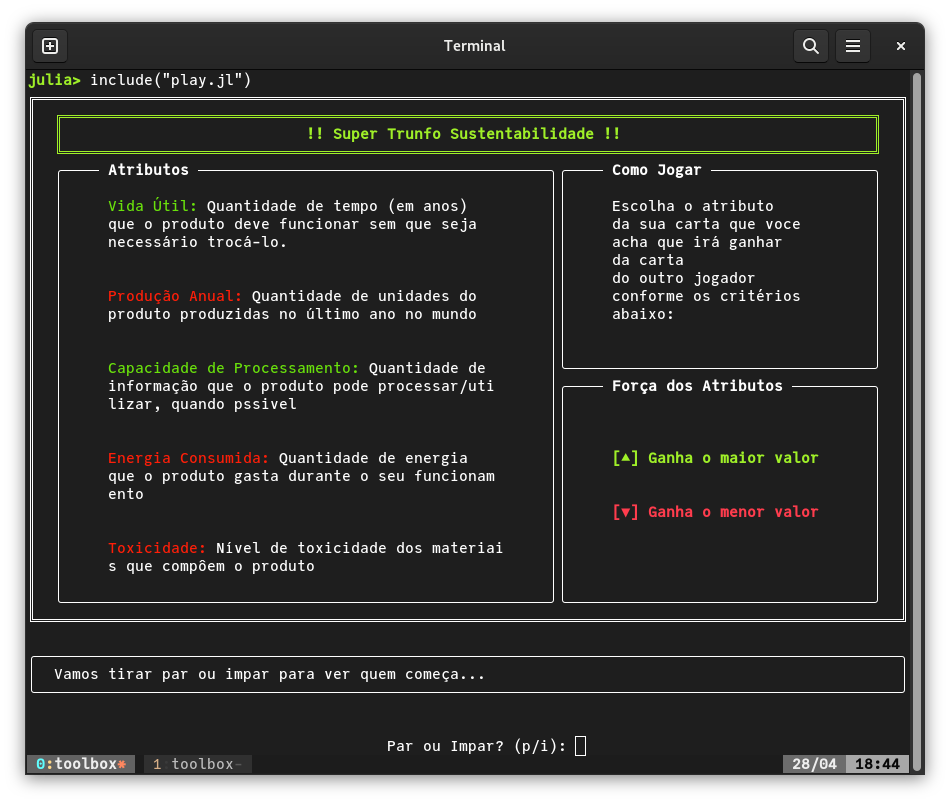
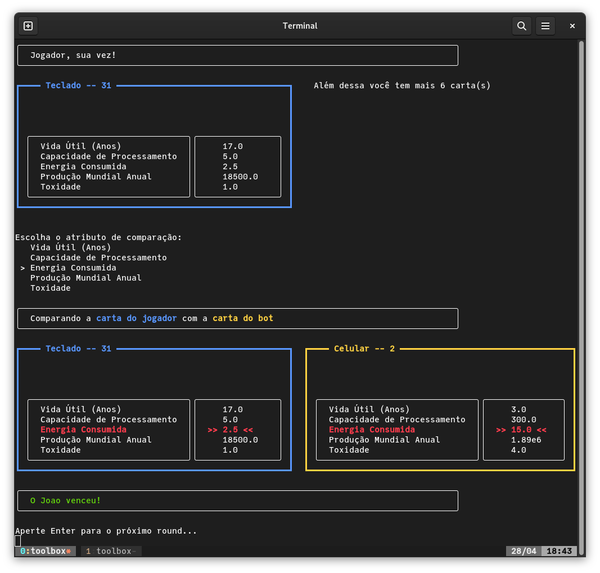
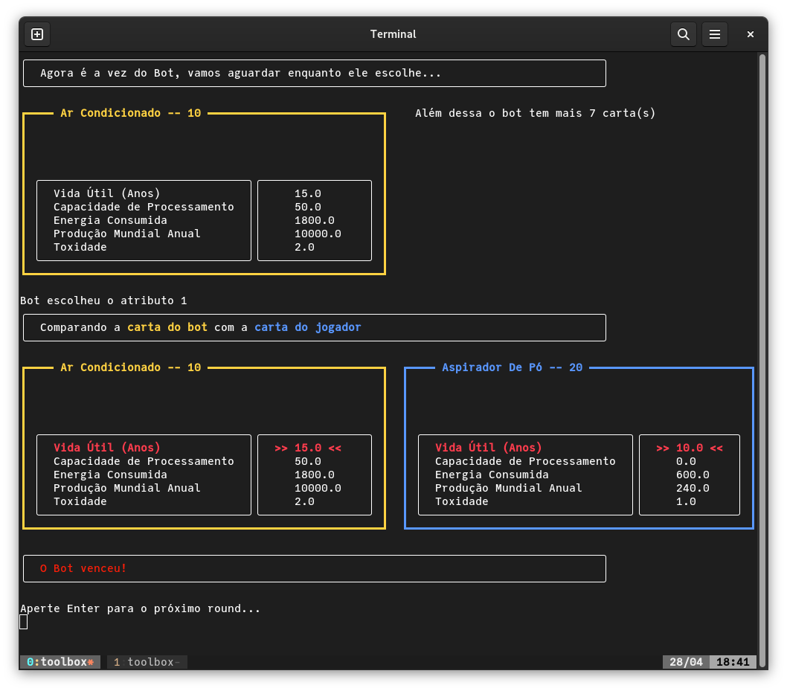

# Super Trunfo 

Implementação do jogo Super Trunfo com tema de sustentabilidade como Projeto Prático
da disciplina de Sustentabilidade e Computação no primeiro semestre de 2022. O jogo
é composto por 32 cartas cada correspondente a em equipamento eletro-eletrônico 
utilizado no dia a dia. Cada carta possui 5 atributos 



O objetivo do jogo é fazer com que o adversário fique sem nenhuma carta, a cada
rodada são comparadas as duas cartas que estão nas mãos dos jogadores. O jogador
que ganhou a ultima rodada escolhe um atributo que será utilizado na comparação
e dependendo do resultado da rodada ela pode perder uma cartaou ganhar a carta o
oponente.

<table>
    <tr>
        <td></td>
        <td></td>
    </tr>
</table>


## Utilização 

Assumindo que a `julia` já esta instalada e o repositório já foi clonado, abra
o terminal na raiz do repositório inicie a `juila` no modo interativo digitando:

```bash
$ julia
```

em seguida ative o ambiente correspondente ao projeto SuperTrunfo, para fazer isso
entre no modo gerenciamento de pacotes digitando `]` apenas uma vez. Você verá que
`pkg` em azul à esquerda. Em seguida digite:

```julia
pkg> activate SuperTrunfo

```

Uma vez que o comando terminar de executar você verá `(SuperTrunfo)` escrito à 
esquerda do `pkg`, depois disso basta apertar *backspace* para voltar ao modo
interativo.

Por fim, para executar o jogo utilize:
```julia
julia> include("play.jl")
```

## Implementação

O jogo foi implementado utilizando Julia (v1.7.2) com auxilio do [Term.jl](https://github.com/FedeClaudi/Term.jl), a representação das cartas e dos jogadores é feita por meio dos tipos
`Card` e `Player`, respectivamente. Também foram utilizados os pacotes [DataFrames.jl](https://github.com/JuliaData/DataFrames.jl) e [DataStructures.jl](https://github.com/JuliaCollections/DataStructures.jl) para fucionalidades auxiliares.

Os conteúdos do repositório estáo organizados da
seguinte maneira:

| **Item** | **Descrição** |
|-----|--- |
| `SuperTrunfo/src/SuperTrunfo.jl` | Módulo com definições de tipos além das funções auxiliares utilizadas pelo jogo. |
| `baralho.csv` | Arquivo `.csv` contendo os atributos das cartas disponíveis no jogo.|
| `play.jl` | Função principal contendo o loop principal utilizado no |
| `generate.jl` | Durente o desenvolviemnto do jogo este script foi utilizados simulação as cartas por meio da geração de valores pseudo-aleatórios em cada um dos atributos das cartas. |
